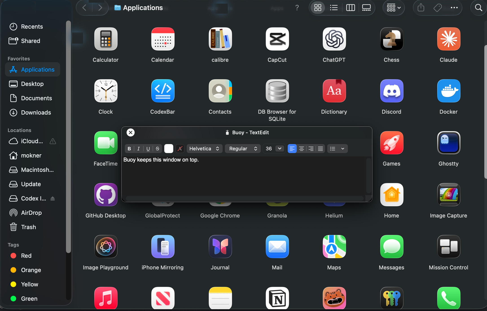

# Buoy

Keep any window on top of everything else on your Mac, and still use it.



## Install

```sh
brew install --cask maokner/tap/buoy
```

Or grab `Buoy.dmg` from the [latest release](../../releases/latest) and drag Buoy to Applications.

## Use

- Press **⌥⇧P** to pin the window you're in. Press it again, or **⌥⇧U**, to unpin.
- Or click the Buoy icon in the menu bar, choose **Pin a Window**, and click any window.

The first time, macOS asks for Screen Recording (and Accessibility, for pinning in place). Grant them once and you're set. Nothing leaves your Mac.

## License

[MIT](LICENSE)
